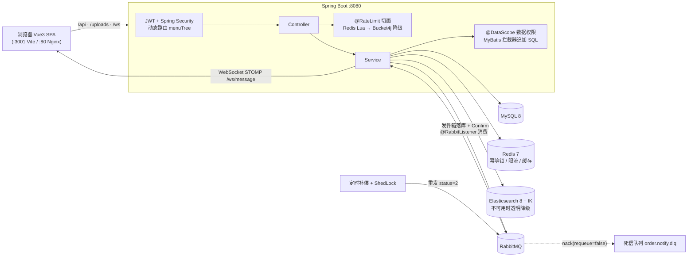

# Aurora Admin

Spring Boot 3 + Vue 3 电商后台管理系统。

展示生产级工程实践的电商后台管理系统，核心设计：

- **可靠消息投递**：RabbitMQ 发件箱模式 + 死信队列 + 补偿任务，保证消息最终一致性
- **多层降级限流**：Redis Lua 分布式限流 + 本地 Bucket4j 自动降级，限流功能不依赖外部组件
- **商品搜索**：Elasticsearch 8 + IK 中文分词，启动自动建索引，ES 不可用时透明降级
- **幂等与并发控制**：Redis 幂等锁 + 乐观锁扣库存，防止重复下单和超卖

## 新同学看这里

**从 `docs/` 开始，按编号顺序操作，一次搞定所有依赖：**

```
docs/
├── 00-环境搭建指南.md          ← 从这里开始！前置条件总览
├── 01-Docker安装MySQL及配置.md
├── 02-Docker安装Redis及配置.md
├── 03-Docker安装RabbitMQ及配置.md
├── 04-Docker安装Elasticsearch及配置.md
├── 05-前端项目运行指南.md       ← 前端 Node.js 环境 & 启动说明
└── notes/interview-qa.md        ← 实现原理剖析与面试 Q&A（进阶阅读）
```

简单来说：装好 Docker Desktop → 按 01~04 拉镜像启动中间件 → 启动后端 → 按 05 装 Node 启动前端。

## 技术栈

| 层级 | 技术 |
|------|------|
| 后端 | Java 21, Spring Boot 3, MyBatis-Plus 3, MySQL 8 |
| 缓存 | Redis (Lettuce) |
| 消息队列 | RabbitMQ |
| 搜索引擎 | Elasticsearch 8 |
| 前端 | Vue 3, TypeScript, Vite, Pinia, Element Plus, ECharts |
| 认证 | JWT + Spring Security |

## 架构总览



核心链路：下单经幂等锁 + 乐观锁扣库存防超卖；订单通知走「本地消息表 → Publisher Confirm → 2 分钟补偿 → DLQ」保最终一致；限流和搜索均在中间件故障时自动降级，不阻塞主流程。

## 快速启动

### 方式一：本地开发（推荐）

**只启动中间件**，后端和前端在本地 IDE 里运行，方便调试和热更新：

```bash
# 终端 1：启动中间件（MySQL + Redis + RabbitMQ + ES，后台运行）
docker compose up -d mysql redis rabbitmq elasticsearch

# 终端 2：启动后端（Java 21 + Spring Boot 3，端口 8080）
cd backend && mvn spring-boot:run

# 终端 3：启动前端（Vite 开发服务器，端口 3001）
cd frontend && npm install && npm run dev
```

> 后端在 IntelliJ IDEA 中打开 `backend/` 目录，运行 `AuroraAdminApplication.java` 效果相同。  
> `application-dev.yml` 的连接参数默认值已对齐 docker-compose 的中间件配置，开箱即用。

### 方式二：全部容器化（演示/部署）

```bash
docker compose up -d
```

前端：http://localhost:80 | 后端 API：http://localhost:8080

## 默认账号

| 角色 | 用户名 | 密码 | 说明 |
|------|--------|------|------|
| 超级管理员 | `admin` | `admin123` | 首次建库自动创建 |
| 普通用户 | `user` | `123456` | 首次建库自动创建 |

## 项目结构

```
backend/  src/main/java/com/aurora/admin/
  controller/   # REST 接口
  service/      # 业务逻辑
  mapper/       # MyBatis-Plus 数据访问
  entity/       # 数据库实体
  dto/          # 请求/响应 DTO（Java record）
  config/       # Spring 配置
  filter/       # JWT 过滤器
  task/         # 定时任务
  aspect/       # AOP 切面
  document/     # ES 文档模型（ProductDocument）

frontend/  src/
  views/        # 页面组件
  stores/       # Pinia 状态管理
  api/          # 后端 API 封装
  router/       # 动态路由
  components/   # 公共组件
  directives/   # 自定义指令（v-permission）
docs/           # 环境搭建指南（00~05）+ 原理剖析笔记（notes/）
```

## 常用命令

```bash
# 后端
cd backend && mvn test                    # 运行测试
cd backend && mvn spring-boot:run         # 启动服务

# 前端
cd frontend && npx tsc --noEmit           # TypeScript 类型检查
cd frontend && npx playwright test        # E2E 测试

# 验证中间件
curl http://localhost:9200                 # ES 是否就绪
# RabbitMQ 管理面板：http://localhost:15672（admin / admin123）
```

## 许可

本项目基于 [MIT License](LICENSE) 开源。
